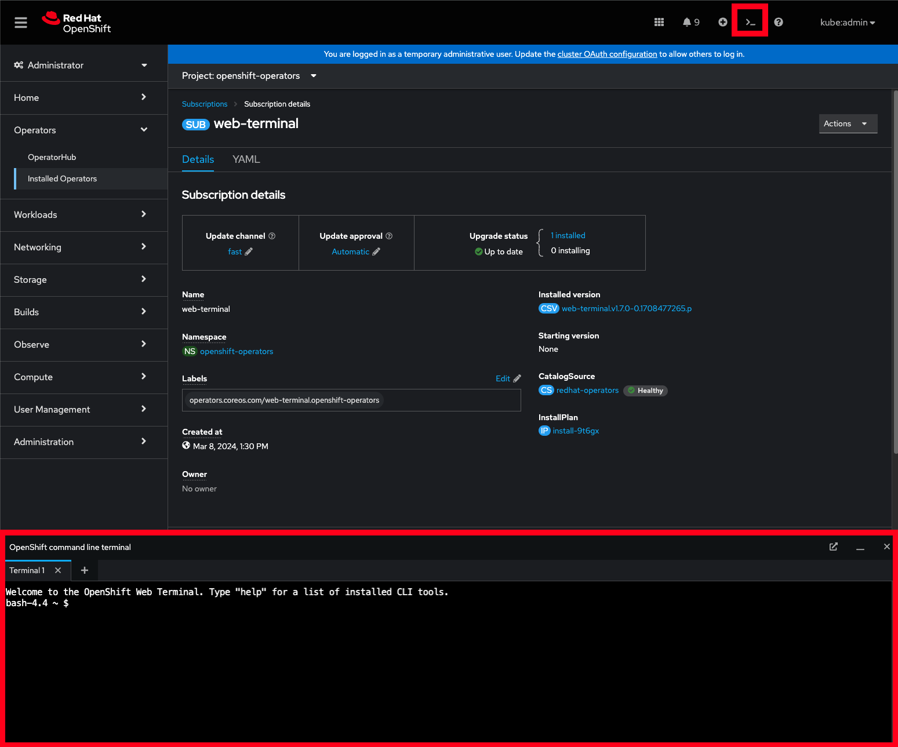

# web-terminal-operator

Deploys the web terminal operator and customizes the image on Red Hat OpenShift via kustomize

## Usage

Install the operator and set the Update channel

```
$ oc apply -k operator/overlays/fast
```



Customize the terminal with common tools
oc         4.12.0          OpenShift CLI
kubectl    1.25.2          Kubernetes CLI
kustomize  4.5.7           Kustomize CLI (built-in to kubectl)
helm       3.10.1          Helm CLI
kn         1.7.1           KNative CLI
tkn        0.28.0          Tekton CLI
subctl     0.13.1          Submariner CLI
odo        3.10.0          Red Hat OpenShift Developer CLI
virtctl    0.58.1          KubeVirt CLI
jq         1.6             jq

```
$ oc apply -k instance/overlays/enhanced
```


